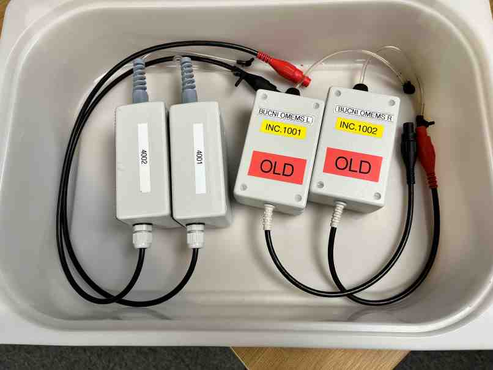

# omems-filters
Equalisation filters, script and log file for users of OMEMS MRI earphones.

## Update 22/04/2026

The original pair of OMEMS installed in the BUCNI Prisma scanner have now been labelled with additional red stickers marked "OLD". A new pair of OMEMS has also been added to the scanner equipment and can be found in the OMEMS drawer next to the scanner.

### **** IMPORTANT NOTE ****

- If you have an on-going study in which you have already used OMEMS please continue using the OLD pair comprising device numbers 1001 (subject's left ear, black connector) and 1002 (subject's right ear, red connector).

- If you have a new study, in which you have not already started to use OMEMS, please use the NEW pair comprising device numbers 4001 (left, black connector) and 4002 (right, red connector).

### Equalisation filers

The OMEMS devices have a reasonably wide and consistent audio response which may be appropriate but where a more uniform audio response is required an equalisation procedure based on an individual device calibration has been provided. You should use the Matalb script "apply_filters.m" if you wish to apply these equalisation fiters to audio files to be played to subjects.

Equalisation filters for both the old and new OMEMS pairs are found in the "filters" subdirectory of the omems-filters repository. A filter appropriate to the OMEMS pair in use must be selected. When using apply_filter.m please select the filters according to the their device serial numbers.

The old OMEMS pair have serial numbers 1001 and 1002. The new pair have serial numbers 4001 and 4002. The equalisation files are named with the serial number of the left channel followed by the date and time at which it was calibrated and then the serial number of the right channel followed by its calibration date and time. So, for example, for the old OMEMS with Shure ear-tips select the equalisation file named "1001-20260324-131413---1002-20260324-131841---Shure.mat"). For the new OMEMS pair select a file starting 4001... (e.g. 4001-20251218-130141---4002-20251218-131207.mat).

### QA, Recalibration and Updated filters

A regular, weekly, quality assureance (QA) procedure is being carried out to verify that the audio response of the OMEMS devices, both old and new, remains consistent with it's calibration. The QA results are logged to the "filters.log" file in the omems-filters Github repository.

If the QA procedure determines the response differs by more than would be expected by repeat measurement with slightly different eartip positioning a new calibration will be performed and newer equalisation files will become available. Our advice would usually be to pick then newest equalisation file on commencement of a project and then continue with with that equalisation.

If the QA procedure determines that a device has become faulty and / or its performance had changed markedly (e.g. a frequency response with the largest diference to the original, reference frequency reponse exceeding 3 dB) the device will be repaired and then re-calibrated with a new equalisation file being made available as above. An alternative backup pair may be installed (e.g. S/N 4007...4008) in place of the faulty pair with an appropriate equalisation filter file being made available. [We plan to make the alternative pair and equalisation files available ahead of time to allow for preparation back-up stumuli tuned to the replacenet OMEMS].